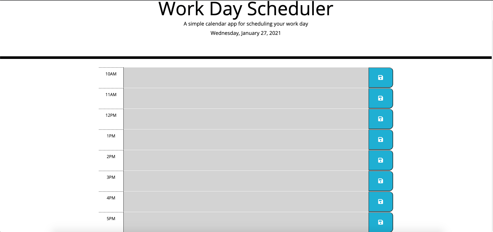

# Work_Day_Schedular

## Description 

This is a simple workday calender application that allows the user to save events for each hour of the day. This app runs in the browser and features dynamically updated HTML and CSS powered by jQuery. The app also uses third-party API with Day.js to give the current date.

When the calender is opened the current date is displayed at the top. When the user scrolls down, the time blocks for each hour of the workday are present. Each block is color-coded depending on if the time block is in the past, present, or future. Each block also has a save button to save any events entered for that time block in local storage. When the page is refreshed the events entered persist.

## Installation

Application Website URL: https://patelg1.github.io/Work_Day_Schedular/

Repository URL: https://github.com/patelg1/Work_Day_Schedular

## Usage 

